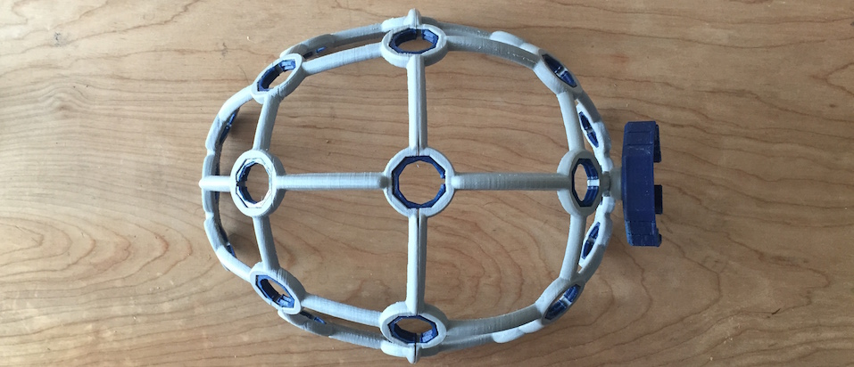
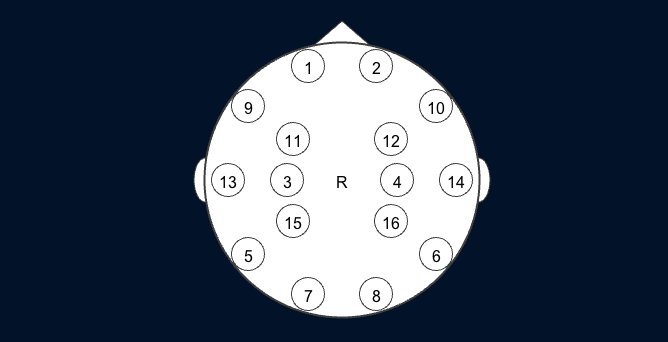
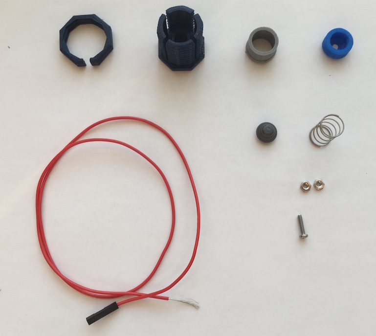
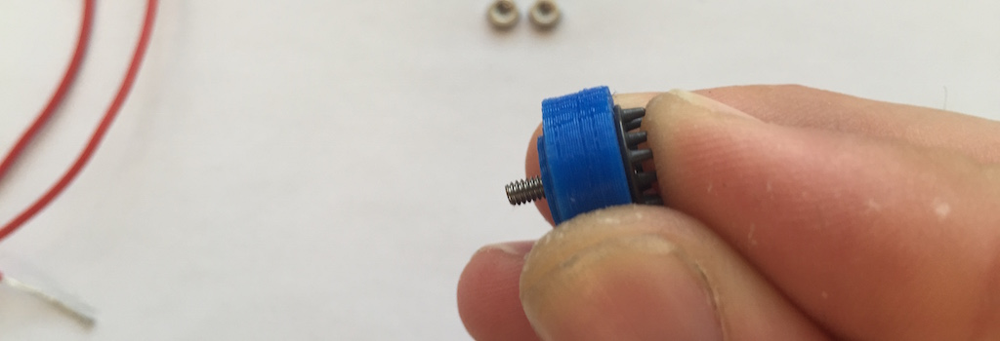

#Ultracortex Mark3
(July 2015 — September 2015)

Designers & Engineers:

* [Aaron Trocolla (aka Threeform)](http://threeformfashion.com/)
* [Conor Russomanno](https://twitter.com/russomanno15)
* [Joel Murphy (aka SafeForRobots)](https://twitter.com/safeforrobots)

We want to give a big thank you to [3D SYSTEMS](http://www.3dsystems.com/) for their generous support in the Ultracortex Mark3 development process!

### THE COMPLETE HEADSET

**Note:** the part quantities listed below assume you are making an electrode holder for all 21 nodes of the Ultracortex Mark3. In reality, you will likely have only 8 or 16 electrodes, depending on whether you are working with the [OpenBCI 32bit Board](http://openbci.myshopify.com/collections/frontpage/products/openbci-32-bit-board-kit) (8 channels) or the [OpenBCI 16-channel R&D Kit](http://openbci.myshopify.com/collections/frontpage/products/openbci-16-channel-r-d-kit) (16 channels). You may only want to create as many electrode units as you have channels, and then add more as necessary. In general, more electrodes will distribute the downware scalp pressure, increasing comfort.

#####3D-printed parts:

* [FRAME](https://github.com/OpenBCI/Ultracortex/tree/master/Mark_3/STLs/FRAME) (head circumfrence: small = 48-54cm; medium = 52-58cm; large = 56-62cm)
	* FRAME_FRONT (**x1**) — .STLs ([small](https://github.com/OpenBCI/Ultracortex/raw/master/Mark_3/STLs/FRAME/small/FRONT_small.stl) / [medium](https://github.com/OpenBCI/Ultracortex/raw/master/Mark_3/STLs/FRAME/medium/FRONT_medium.stl) / [large](https://github.com/OpenBCI/Ultracortex/raw/master/Mark_3/STLs/FRAME/large/FRONT_large.stl))
	* FRAME_BACK (**x1**) — .STLs ([small](https://github.com/OpenBCI/Ultracortex/raw/master/Mark_3/STLs/FRAME/small/BACK_small.stl) / [medium](https://github.com/OpenBCI/Ultracortex/raw/master/Mark_3/STLs/FRAME/medium/BACK_medium.stl) / [large](https://github.com/OpenBCI/Ultracortex/raw/master/Mark_3/STLs/FRAME/large/BACK_large.stl))
* [MECH_PARTS](https://github.com/OpenBCI/Ultracortex/tree/master/Mark_3/STLs/MECH_PARTS)
	* [OCTANUT](https://github.com/OpenBCI/Ultracortex/blob/master/Mark_3/STLs/MECH_PARTS/OCTANUT.stl) (**x21**) — [.STL download link](https://github.com/OpenBCI/Ultracortex/raw/master/Mark_3/STLs/MECH_PARTS/OCTANUT.stl)
	* [OCTABOLT](https://github.com/OpenBCI/Ultracortex/blob/master/Mark_3/STLs/MECH_PARTS/OCTABOLT.stl) (**x21**) — [.STL download link](https://github.com/OpenBCI/Ultracortex/raw/master/Mark_3/STLs/MECH_PARTS/OCTABOLT.stl)
	* [SPRING_CASING](https://github.com/OpenBCI/Ultracortex/blob/master/Mark_3/STLs/MECH_PARTS/SPRING_CASING.stl) (**x21**) — [.STL download link](https://github.com/OpenBCI/Ultracortex/raw/master/Mark_3/STLs/MECH_PARTS/SPRING_CASING.stl)
	* [ELECTRODE_HOLDER](https://github.com/OpenBCI/Ultracortex/blob/master/Mark_3/STLs/MECH_PARTS/ELECTRODE_HOLDER.stl) (**x21**) — [.STL download link](https://github.com/OpenBCI/Ultracortex/raw/master/Mark_3/STLs/MECH_PARTS/ELECTRODE_HOLDER.stl)
* [BOARD_HOLDER](https://github.com/OpenBCI/Ultracortex/blob/master/Mark_3/STLs/BOARD_HOLDER.stl) (**x1**) — [.STL download link](https://github.com/OpenBCI/Ultracortex/raw/master/Mark_3/STLs/BOARD_HOLDER.stl)
* BOARD_COVER (**x1**) — choose STANDARD or ADVANCED
	* [STANDARD](https://github.com/OpenBCI/Ultracortex/blob/master/Mark_3/STLs/BOARD_COVER_logo.stl) — [.STL download link](https://github.com/OpenBCI/Ultracortex/raw/master/Mark_3/STLs/BOARD_COVER_logo.stl)
	* [ADVANCED](https://github.com/OpenBCI/Ultracortex/blob/master/Mark_3/STLs/BOARD_COVER_advancedVersion.stl) (for extra hardware accessibility / if you've soldered on your header rows) — [.STL download link](https://github.com/OpenBCI/Ultracortex/raw/master/Mark_3/STLs/BOARD_COVER_advancedVersion.stl)

#####Non-printed parts:
 	
* Additional Hardware:
	* **Suggested Springs** listed below (**x21**)
	* **Suggested Nuts** listed below (**x42**)
	* **Suggested Bolts** listed below (**x21**)
	* 1/4" #4 Drive Screw listed below (**x8**) for mounting the BOARD_HOLDER and OpenBCI Board
* Wiring (**x21**)
	* We strip apart electrodes from the [Electrode Starter Kit](http://openbci.myshopify.com/collections/frontpage/products/openbci-electrode-starter-kit)) or from the Touch-Proof Connector cable that comes with an [OpenBCI 32bit Board Kit](http://openbci.myshopify.com/collections/frontpage/products/openbci-32-bit-board-kit).
* Dry electrodes by Florida Research Instruments
	* (**18x**) Dry (spikey) electrodes to be installed in Ultracortex nodes with hair: [Disposable / Reusable Dry EEG Electrode ($0.60 each at 50+ quantity purchase) ](http://fri-fl-shop.com/product/tde-200/)
	* (**3x**) Dry (non-spikey) electrodes to be installed in Ultracortex nodes without hair (forehead, for instance): [Disposable / Reusable Cup Wet/Dry EEG Electrode ($10.00 for 15) ](http://fri-fl-shop.com/product/disposable-reusable-dry-eeg-electrode-quantity-of-15-tde-200a1/)
	* (**2x**) Ear Clip electrode (for reference): [TDI-430 Silver-Silver Chloride Ear Clip Electrode ($19.95 each)](http://fri-fl-shop.com/product/td-430-silver-disc-electrode-ear-clip/)
* (**1x**) An [OpenBCI 32bit Board](http://openbci.myshopify.com/collections/frontpage/products/openbci-32-bit-board-kit) or an [OpenBCI 16-channel R&D Kit](http://openbci.myshopify.com/collections/frontpage/products/openbci-16-channel-r-d-kit)
* (**1x**) Lithium Ion Rechargeable Battery Pack (~500mAh) — [Sparkfun](https://www.sparkfun.com/products/10718) or [Adafruit](http://www.adafruit.com/products/1578)
* (**1x**) [A charger for your battery pack](https://www.adafruit.com/products/1304)

####FRAME

 

####MECH_PARTS

 

####BOARD_HOLDER

 

####BOARD_COVER

 

###Additional Hardware (Springs, Nuts, Bolts, & Screws)

#####Suggested Springs: 
* (**21x**) [Century Spring Corp. Stock #: U-4](http://www.centuryspring.com/Store/globalresults.php)

#####Suggested Nuts/Bolts:

We use small stainless steel screws and hex nuts to fasten the FRI electrodes (listed above) to the 3D-printed electrode mount components &  wiring that connects the electrodes back to the OpenBCI board. We used stripped [Electrode Starter Kit (ESK)](https://openbci.myshopify.com/collections/frontpage/products/openbci-electrode-starter-kit) electrodes as the cabling, by removing the gold cup with a wire cutter and looping the exposed wire around the screw between the two tightened hex nuts (as seen in the picture below).

* (**21x**) [Stainless Steel Pan Head Phillips Machine Screw, 2-56 Thread, 3/8" Length ($5.70 per pack of 50)](http://www.mcmaster.com/#91735a017/=xzahfj)
* (**42x**) [Stainless Steel Hex Nut, 2-56 Thread Size, 3/16" Wide, 1/16" High](http://www.mcmaster.com/#91841a003/=xzahv0)

#####Suggested Screws for Fastening BOARD_MOUNT & OpenBCI Board

* (**8x**) [#4 Drive Screw](http://www.mcmaster.com/#90077a106/=yysd5f)

#####Wiring

* (**21x**) We strip apart electrodes from the [Electrode Starter Kit](http://openbci.myshopify.com/collections/frontpage/products/openbci-electrode-starter-kit)) or from the Touch-Proof Connector cable that comes with an [OpenBCI 32bit Board Kit](http://openbci.myshopify.com/collections/frontpage/products/openbci-32-bit-board-kit).

#####Dry electrodes by Florida Research Instruments

* (**18x**) Dry (spikey) electrodes to be installed in Ultracortex nodes with hair: [Disposable / Reusable Dry EEG Electrode ($0.60 each at 50+ quantity purchase) ](http://fri-fl-shop.com/product/tde-200/)
* (**3x**) Dry (non-spikey) electrodes to be installed in Ultracortex nodes without hair (forehead, for instance): [Disposable / Reusable Cup Wet/Dry EEG Electrode ($10.00 for 15) ](http://fri-fl-shop.com/product/disposable-reusable-dry-eeg-electrode-quantity-of-15-tde-200a1/)
* (**2x**) Ear Clip electrode (for reference): [TDI-430 Silver-Silver Chloride Ear Clip Electrode ($19.95 each)](http://fri-fl-shop.com/product/td-430-silver-disc-electrode-ear-clip/)

##### (1x) An [OpenBCI 32bit Board](http://openbci.myshopify.com/collections/frontpage/products/openbci-32-bit-board-kit) (8 electrode channels) or an [OpenBCI 16-channel R&D Kit](http://openbci.myshopify.com/collections/frontpage/products/openbci-16-channel-r-d-kit) (16 electrode channels)

#####(**1x**) Lithium Ion Rechargeable Battery Pack (~500mAh) — [Sparkfun](https://www.sparkfun.com/products/10718) or [Adafruit](http://www.adafruit.com/products/1578) & (**1x**) [A charger for your battery pack](https://www.adafruit.com/products/1304)

## PRINT SETTINGS

* FRAME_FRONT & FRAME_BACK
	* Material: PLA
	* Supports: YES
	* Raft: hopefully NO (but if supports aren't sticking, try the raft)
	* Infill: 20%
	* Layer Heigh: 0.2mm
	* Number of Shells: 3
	* Speed while extruding: 70%
* MECH_PARTS (OCTANUT / BOLT / SPRING_CASING / ELECTRODE_HOLDER)
	* Material: PLA
	* Supports: NO
	* Raft: NO
	* Infill: 20%
	* Layer Heigh: 0.2mm
	* Number of Shells: 3
	* Speed while extruding: 70%

## Recommended Assembly Tools:

* [Loctite Super Glue w/ Cyanoacrylate](http://www.amazon.com/Loctite-1365882-20-Gram-Bottle-Professional/dp/B004Y960MU/ref=sr_1_1?s=automotive&ie=UTF8&qid=1440204266&sr=1-1&keywords=loctite+cyanoacrylate&pebp=1440204267936&perid=0HJQ0FB9G4J9SEBQBVGA)
* coarse flat & circular files (for removing support artifacts)
* medium sand paper
* exacto blade
* philips head screw driver
* wire cutters
* needle-nose pliers

## Assembly Instructions:

### Remove residual support material & print flaws

### Glue the FRAME together

### Mount the OpenBCI BOARD_HOLDER

Use the #4 Drive Screws to mount the BOARD_HOLDER to the FRAME

### Insert OCTANUT pieces (x21) into frame

**Note:** at each node, you must line up the cut in the OCTANUT with the indentation on the frame as indicated in the picture below.

Your Ultracortex should now look like this:

### Identify electrode locations

### Assemble electrode mounts (x8 or x16)
**Note:** repeat this step as many times as necessary, depending upon your OpenBCI setup. You may want to make additional electrode  and keep them 

### Insert electrode mounts into headset

### Embed OpenBCI into the Ultracortex

### Connect electrodes to OpenBCI

### Connect Ear Clip Electrodes

### Fasten the BOARD_COVER

### Adjust the Ultracortex for your head

### Examine your brain waves!

